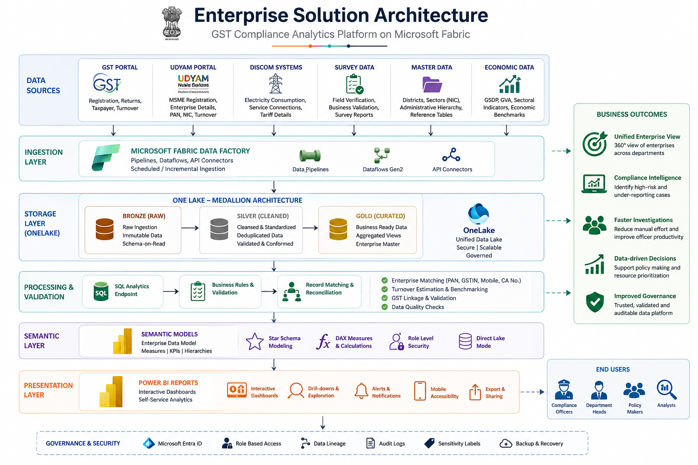

# Enterprise Solution Architecture

This diagram illustrates the end-to-end Microsoft Fabric architecture used for the GST Compliance Analytics Platform.

## Architecture Overview

## Overview

The platform consolidates multiple government datasets—including GST, Udyam, DISCOM, Survey, and Economic data—into a unified Microsoft Fabric environment. Data is ingested through Fabric Pipelines, transformed using a Medallion Lakehouse architecture, validated through SQL-based reconciliation, and exposed via Semantic Models for interactive Power BI reporting.

## Key Components

### Data Sources
- GST Portal
- Udyam MSME Registry
- DISCOM Electricity Data
- Survey Data
- Master Reference Data
- GSDP/GVA Economic Indicators

### Ingestion Layer
- Microsoft Fabric Pipelines
- Dataflows Gen2
- REST API Connectors

### Storage Layer
- OneLake
- Bronze
- Silver
- Gold

### Processing Layer
- Data Validation
- Record Matching
- Enterprise Reconciliation
- Business Rules

### Semantic Layer
- Power BI Semantic Model
- DAX
- Star Schema
- Row-Level Security
- Direct Lake

### Presentation Layer
- Power BI Dashboards
- Interactive Reports
- Drill-through Analysis

## Business Outcome

- Unified enterprise view
- Faster compliance investigations
- Automated reconciliation
- District-wise risk identification
- Self-service analytics
